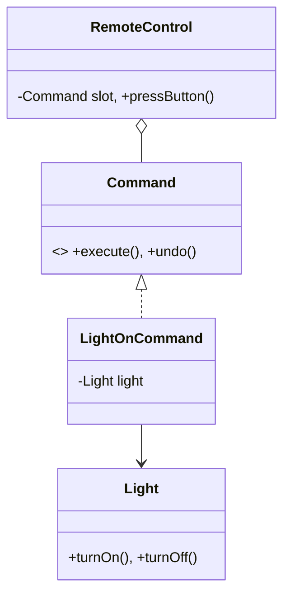

# Home Automation (Command Pattern)

This example demonstrates how the Command pattern decouples the sender (Remote) from the receiver (Light/AC).

## Examples in this Folder

### 1. [Good Code](./GoodCode/)
- **Design**: The `RemoteControl` (Invoker) only holds a reference to the `Command` interface.
- **Benefit**: You can add new devices (e.g., `SmartCurtains`) simply by creating a new `Command` class. No changes are needed to the `RemoteControl` code.

### 2. [Bad Code](./BadCode/)
- **Problem**: The `BadRemoteControl` is hardcoded with `if-else` blocks for every device.
- **Consequence**: Tight coupling makes the system fragile and hard to extend.

## UML Diagram

