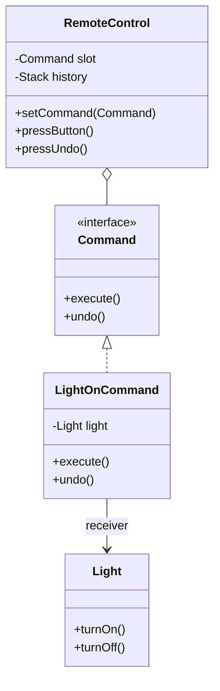

# Command Design Pattern

> "Encapsulate a request as an object, thereby letting you parameterize clients with different requests, queue or log requests, and support undoable operations." - GoF

## Overview
The Command pattern is a behavioural design pattern that turns a request into a stand-alone object that contains all information about the request.

### When to Use?
1. **Undo/Redo Operations**: When you need to keep a history of actions that can be reversed.
2. **Decoupling Senders and Receivers**: When you want to separate the object that triggers an action (Invoker) from the object that performs it (Receiver).
3. **Queueing/Scheduling Tasks**: When you want to store commands in a list to execute them later.

## Key Concept: The Four Pillars

| Component | Responsibility |
| :--- | :--- |
| **Command Interface** | Defines the contract (usually `execute()` and `undo()`). |
| **Concrete Command** | Implements the interface by calling specific methods on the Receiver. |
| **Receiver** | The actual object that performs the work. |
| **Invoker** | The object that triggers the command. |

---

## UML Diagrams

### 1. Home Automation (Decoupling Example)

---

## Examples in this Folder

### 1. [Home Automation](./HomeAutomationExample/)
- **Concept**: A smart remote that only knows about the `Command` interface, allowing it to control any device without being hardcoded to it.
- **Features**: Supports **Undo** operations using a stack-based history mechanism.

---

## How to Run

### Home Automation
- [HomeAutomationMain.java](./HomeAutomationExample/GoodCode/HomeAutomationMain.java)
- [BadCommandMain.java](./HomeAutomationExample/BadCode/BadCommandMain.java)

---
## Navigation
- [Home Automation Example](./HomeAutomationExample/)
