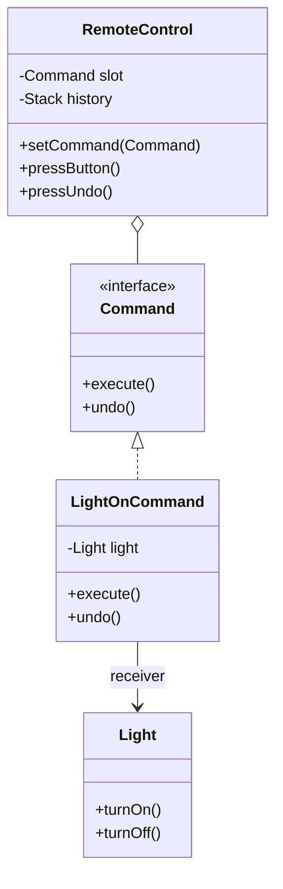
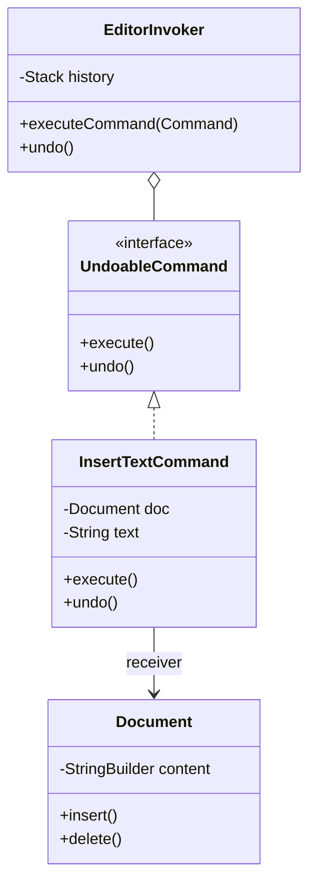

# Command Design Pattern

> "Encapsulate a request as an object, thereby letting you parameterize clients with different requests, queue or log requests, and support undoable operations." - GoF

## Overview
The Command pattern is a behavioural design pattern that turns a request into a stand-alone object that contains all information about the request. This transformation lets you pass requests as a method arguments, delay or queue a request's execution, and support undoable operations.

### When to Use?
1. **Undo/Redo Operations**: When you need to keep a history of actions that can be reversed.
2. **Decoupling Senders and Receivers**: When you want to separate the object that triggers an action (Invoker) from the object that performs it (Receiver).
3. **Queueing/Scheduling Tasks**: When you want to store commands in a list to execute them later or across different threads.
4. **Macro Recording**: When you want to combine several simple commands into a single "Macro" command.

## Key Concept: The Four Pillars

| Component | Responsibility |
| :--- | :--- |
| **Command Interface** | Defines the contract (usually `execute()` and `undo()`). |
| **Concrete Command** | Implements the interface by calling specific methods on the Receiver. |
| **Receiver** | The actual object that performs the work (e.g., Light, Document). |
| **Invoker** | The object that triggers the command (e.g., RemoteControl, Button). |

---

## UML Diagrams

### 1. Home Automation (Decoupling Example)

### 2. Text Editor (Undo/Redo Example)

---

## Examples in this Folder

### 1. [Home Automation](./HomeAutomationExample/)
- **Problem**: A smart remote that is hardcoded to specific devices. Adding a new device (like a Smart Fan) requires modifying the remote's code.
- **Solution**: The remote (Invoker) only knows about the `Command` interface. We can plug in any command (Light, AC, Fan) without changing the remote.

### 2. [Text Editor](./TextEditorExample/)
- **Problem**: Implementing undo/redo logic manually for every action is complex and error-prone.
- **Solution**: Every edit action (Insert, Delete) is a `Command` object that knows how to reverse itself. The editor just maintains a stack of these objects.

---

## How to Run

### Home Automation
- [HomeAutomationMain.java](./HomeAutomationExample/GoodCode/HomeAutomationMain.java)
- [BadCommandMain.java](./HomeAutomationExample/BadCode/BadCommandMain.java)

### Text Editor
- [TextEditorMain.java](./TextEditorExample/GoodCode/TextEditorMain.java)

---
## Navigation
- [Home Automation Example](./HomeAutomationExample/)
- [Text Editor Example](./TextEditorExample/)
