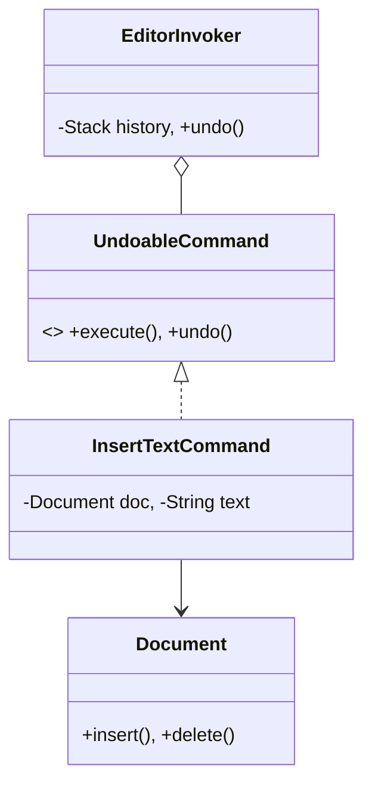

# Text Editor (Command Pattern)

This example demonstrates the power of the Command pattern for implementing **Undo/Redo** functionality.

## Examples in this Folder

### 1. [Good Code](./GoodCode/)
- **Design**: Each editing operation (like `InsertTextCommand`) stores the state necessary to reverse itself (e.g., the position and text inserted).
- **Benefit**: Implementing Undo becomes a simple matter of popping the last command from a stack and calling its `undo()` method.

## UML Diagram

