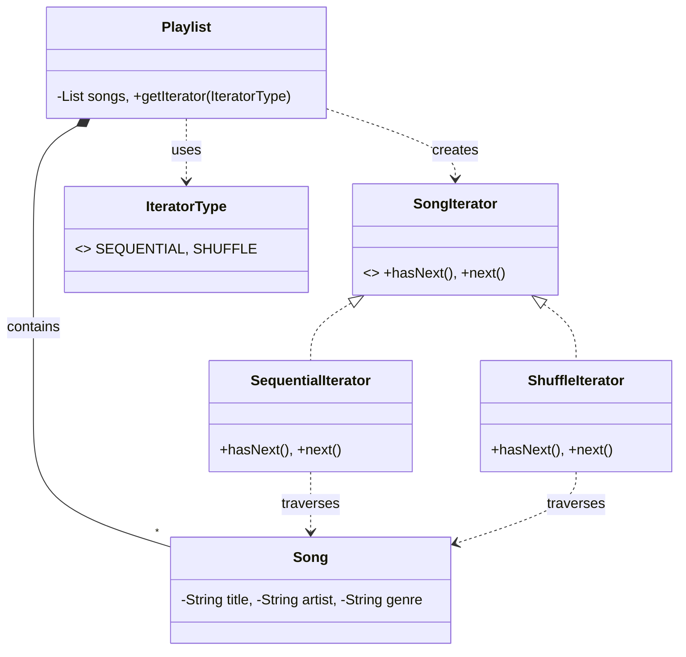
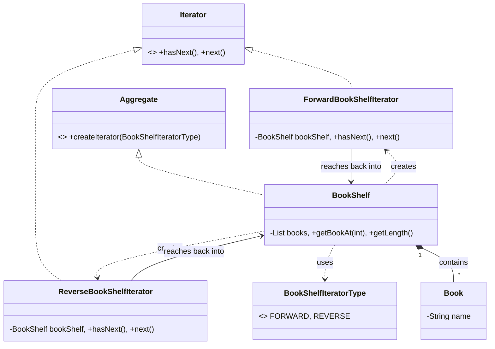

# Iterator Design Pattern

> "Provide a way to access the elements of an aggregate object sequentially without exposing its underlying representation." - GoF

## Overview
The Iterator pattern is a behavioural design pattern that allows you to traverse elements of a collection without exposing its internal structure (List, Stack, Tree, etc.). It encapsulates the traversal logic into a separate object called an **Iterator**.

### When to Use?
1. **Complex Internal Structures**: When your collection has a complex data structure under the hood, but you want to hide this from clients for simplicity and safety.
2. **Multiple Traversal Algorithms**: When you need different ways to traverse the same collection (e.g., Sequential, Shuffle, Reverse, Depth-First).
3. **Uniform Interface**: When you want to provide a uniform interface for traversing different types of structures (e.g., a client can iterate over both a List-based bookshelf and a Tree-based library using the same `next()` method).
4. **Decoupling Collection and Traversal**: When you want to separate the responsibility of "holding data" from "iterating over data."

## Key Concept: Aggregate & Iterator

| Component | Responsibility |
| :--- | :--- |
| **Iterator Interface** | Defines the contract for accessing and traversing elements (`hasNext`, `next`). |
| **Concrete Iterator** | Implements the specific traversal algorithm (e.g., Shuffle, Reverse). |
| **Aggregate Interface** | Defines a method for creating an Iterator object. |
| **Concrete Aggregate** | Holds the data and implements the creation of its own Iterators. |

---

## UML Diagrams

### 1. Music Player Implementation (Parameterized Approach)
*Focuses on flexibility using a single factory method.*

### 2. BookShelf Implementation (Aggregate-Passing Approach)
*Focuses on the formal GoF structure and "live" object connection.*

---

## Examples in this Folder

### 1. [Music Player System](./MusicPlayerExample/)
- **Problem**: In a music app, you want to play songs in different orders (Sequential or Shuffle) without the player knowing how the playlist is stored.
- **Design**: Uses a **Parameterized Factory** method in the `Playlist` to return different `SongIterator` implementations based on an Enum.
- **Result**: The `MusicPlayer` is completely decoupled from the list logic. Adding a "GenreFilter" iterator in the future won't break existing code.

### 2. [BookShelf System](./BookShelfExample/)
- **Problem**: You need a formal way to traverse a library both forward and in reverse while keeping the `BookShelf` clean of traversal code.
- **Design**: Implements the formal `Aggregate` and `Iterator` interfaces. The iterator receives the **entire BookShelf object** in its constructor, allowing for "live" traversal.
- **Result**: Shows how an iterator can "reach back" into the aggregate's public methods (`getBookAt`, `getLength`) to perform its work.

---

## Comparison of Approaches

| Feature | Music Player Example | BookShelf Example |
| :--- | :--- | :--- |
| **Creation** | Parameterized (`getIterator(Type)`) | Explicit Factory (`createIterator`) |
| **Data Scope** | **Snapshot/View**: Iterator gets the list/data. | **Live Object**: Iterator gets the Aggregate. |
| **Flexibility** | High (Enum-driven) | High (Interface-driven) |
| **Dependency** | Iterator depends on Data Type. | Iterator depends on Aggregate Object. |

---

## How to Run

### Music Player Example
- [PlaylistMain.java](./MusicPlayerExample/GoodCode/PlaylistMain.java) (Good Code)
- [BadPlaylistMain.java](./MusicPlayerExample/BadCode/BadPlaylistMain.java) (Bad Code)

### BookShelf Example
- [BookShelfMain.java](./BookShelfExample/GoodCode/BookShelfMain.java) (Good Code)
- [BadBookShelfMain.java](./BookShelfExample/BadCode/BadBookShelfMain.java) (Bad Code)

---
## Navigation
- [Music Player Example](./MusicPlayerExample/)
- [BookShelf Example](./BookShelfExample/)
