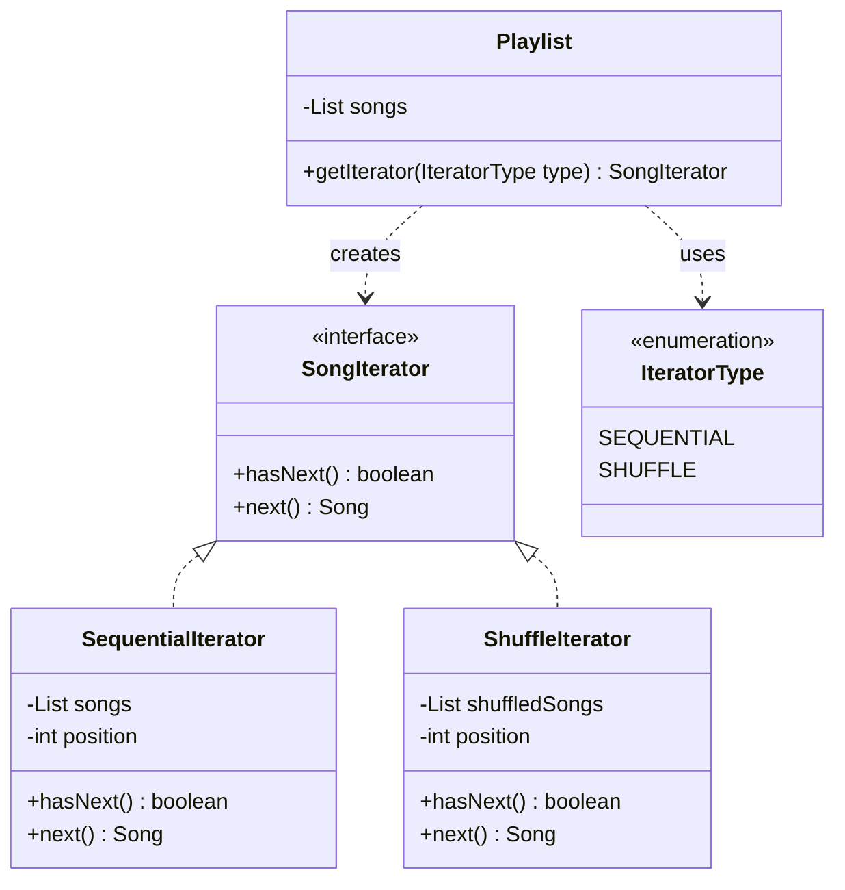

# Iterator Design Pattern

> "Provide a way to access the elements of an aggregate object sequentially without exposing its underlying representation." - GoF

## Overview
The Iterator pattern is a behavioural design pattern that allows you to traverse elements of a collection without exposing its internal structure (List, Stack, Tree, etc.). It encapsulates the traversal logic into a separate object called an **Iterator**.

### When to Use?
1. **Hiding Internal Complexity**: When your collection has a complex data structure under the hood, but you want to hide this from clients.
2. **Multiple Traversal Algorithms**: When you need different ways to traverse the same collection (e.g., Sequential, Shuffle, Depth-First, Breadth-First).
3. **Uniform Interface**: When you want to provide a uniform interface for traversing different structures.

## UML Diagram

## Key Concept: Aggregate & Iterator

| Component | Responsibility |
| :--- | :--- |
| **Iterator Interface** | Defines the methods for accessing and traversing elements (`hasNext`, `next`). |
| **Concrete Iterator** | Implements the traversal logic for a specific algorithm. |
| **Aggregate Interface** | Defines a method for creating an Iterator object. |
| **Concrete Aggregate** | Implements the creation of an Iterator and holds the data. |

## Examples in this Folder

### [Song Playlist System](./GoodCode/)
- **Problem**: In a music app, you might want to play songs sequentially, or shuffle them, or filter by genre. 
- **Bad Code**: The `BadPlaylist` returns its internal `ArrayList`. The client must manually implement shuffle logic. If the playlist changes to an `Array`, the client breaks.
- **Good Code**: The `Playlist` provides `SequentialIterator` and `ShuffleIterator`. The client doesn't know how the songs are stored or how the shuffling algorithm works.

---

## How to Run

### Good Code (Recommended)
- `GoodCode/PlaylistMain.java` (Demonstrates clean, decoupled iteration)

### Bad Code (Anti-pattern)
- `BadCode/BadPlaylistMain.java` (Exposes internal state and leaks logic)

---
## Navigation
- [Good Code Implementation](./GoodCode/)
- [Bad Code Implementation](./BadCode/)
