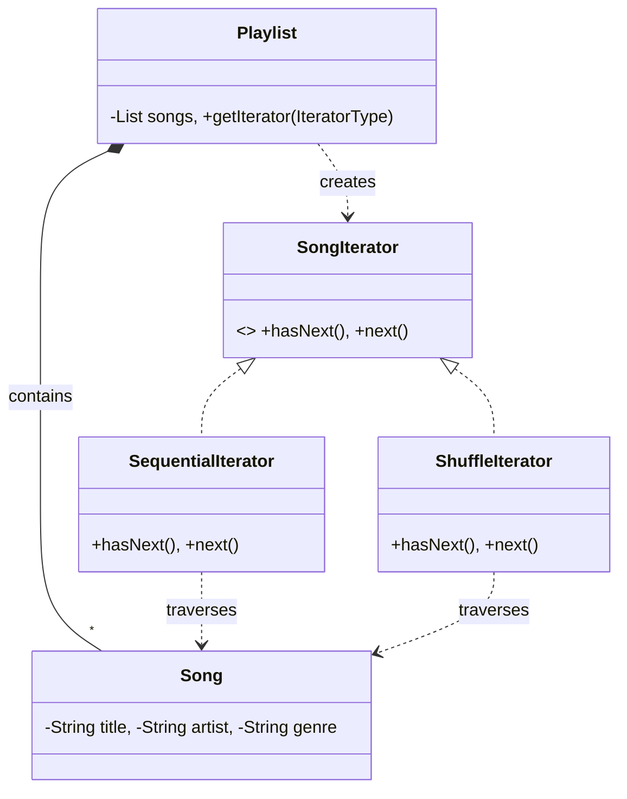
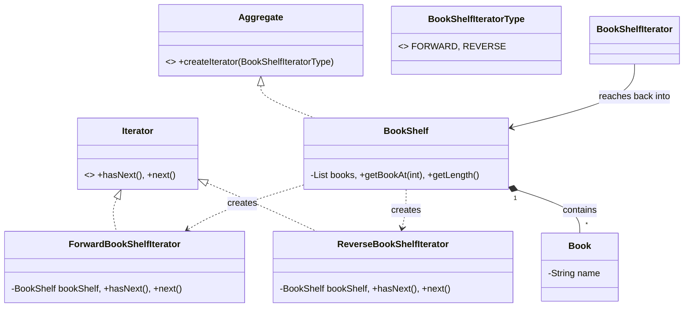

# Iterator Design Pattern

> "Provide a way to access the elements of an aggregate object sequentially without exposing its underlying representation." - GoF

## Overview
The Iterator pattern is a behavioural design pattern that allows you to traverse elements of a collection without exposing its internal structure.

---

## Comparison of Approaches

| Feature | [Music Player](./MusicPlayerExample/) | [BookShelf](./BookShelfExample/) |
| :--- | :--- | :--- |
| **Approach** | Parameterized Factory | Formal GoF Aggregate/Iterator |
| **Good Code** | [View Good Code](./MusicPlayerExample/GoodCode/) | [View Good Code](./BookShelfExample/GoodCode/) |
| **Bad Code** | [View Bad Code](./MusicPlayerExample/BadCode/) | [View Bad Code](./BookShelfExample/BadCode/) |

---

## UML Diagrams

### 1. Music Player Implementation (Parameterized Approach)

### 2. BookShelf Implementation (Aggregate-Passing Approach)

---

## How to Run

### Music Player
- [PlaylistMain.java](./MusicPlayerExample/GoodCode/PlaylistMain.java)
- [BadPlaylistMain.java](./MusicPlayerExample/BadCode/BadPlaylistMain.java)

### BookShelf
- [BookShelfMain.java](./BookShelfExample/GoodCode/BookShelfMain.java)
- [BadBookShelfMain.java](./BookShelfExample/BadCode/BadBookShelfMain.java)

---
## Navigation
- [Music Player Example](./MusicPlayerExample/)
- [BookShelf Example](./BookShelfExample/)
