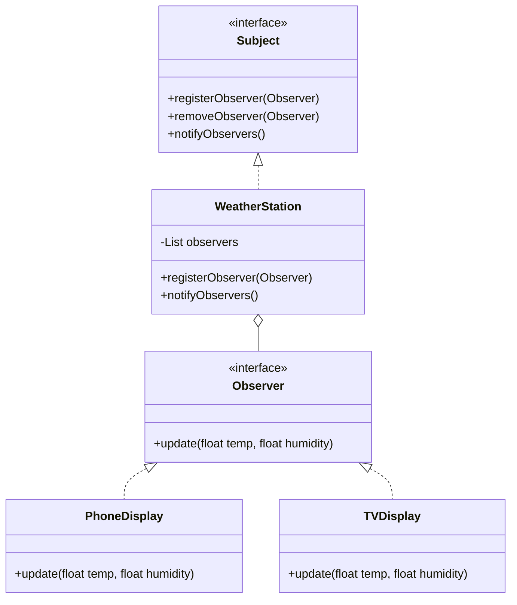
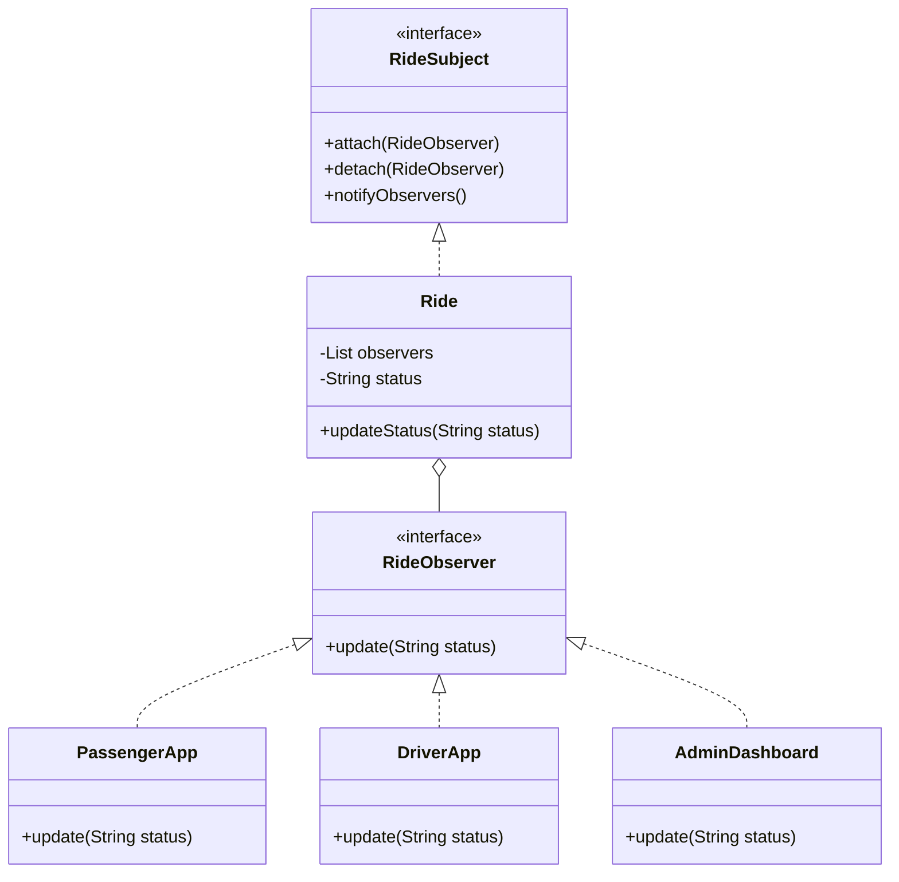

# Observer Design Pattern

> "Define a one-to-many dependency between objects so that when one object changes state, all its dependents are notified and updated automatically." - GoF

## Overview
The Observer pattern is a behavioural design pattern that defines a subscription mechanism to notify multiple objects about any events that happen to the object they're observing. It promotes loose coupling between the source of events (Subject) and the consumers of those events (Observers).

### When to Use?
1. **State Change Propagation**: When a change to one object requires changing others, and you don't know how many objects need to be changed.
3. **Decoupling Producers and Consumers**: When you want to separate the core logic of a system from the multiple ways its data might be displayed or processed.

## UML Diagram

### 2. Ride Sharing System (Uber/Ola)

## Key Concept: Subject & Observer

| Component | Responsibility |
| :--- | :--- |
| **Subject (Observable)** | Maintains a list of observers and provides methods to attach, detach, and notify them. |
| **Observer Interface** | Defines the updating interface for objects that should be notified of changes in a subject. |
| **Concrete Subject** | Stores the state of interest and sends a notification to its observers when its state changes. |
| **Concrete Observer** | Implements the Observer interface and defines the behavior to be executed when notified. |

## Examples in this Folder

### 1. [Weather Monitoring System](./WeatherExample/)
- **Problem**: The `BadWeatherStation` is hardcoded to specific display classes (Phone, TV). Adding a new display requires modifying the core station logic.
- **Design**: Uses a `WeatherSubject` interface and multiple `WeatherObserver` implementations.
- **Result**: New displays (e.g., Smart Watch, Web) can be added at runtime without touching the `WeatherStation` class.

### 2. [Ride Sharing System (Uber/Ola)](./RideSharingExample/)
- **Problem**: Ride status updates (Arrived, Started, Completed) need to trigger different actions in the Passenger app, Driver app, and Admin system.
- **Design**: The `Ride` class acts as the Subject, notifying all attached apps when the status changes.
- **Result**: Decouples the ride-tracking logic from the UI/logging requirements of different platforms.

---

## How to Run

### Weather Example
- `WeatherExample/BadCode/BadWeatherStation.java` (Tight coupling violation)
- `WeatherExample/GoodCode/WeatherMain.java` (Clean Observer implementation)

### Ride Sharing Example
- `RideSharingExample/BadCode/BadRide.java` (Hardcoded notifications)
- `RideSharingExample/GoodCode/RideSharingMain.java` (Decoupled event broadcasting)

---
## Navigation
- [Weather Monitoring Example](./WeatherExample/)
- [Ride Sharing Example](./RideSharingExample/)
