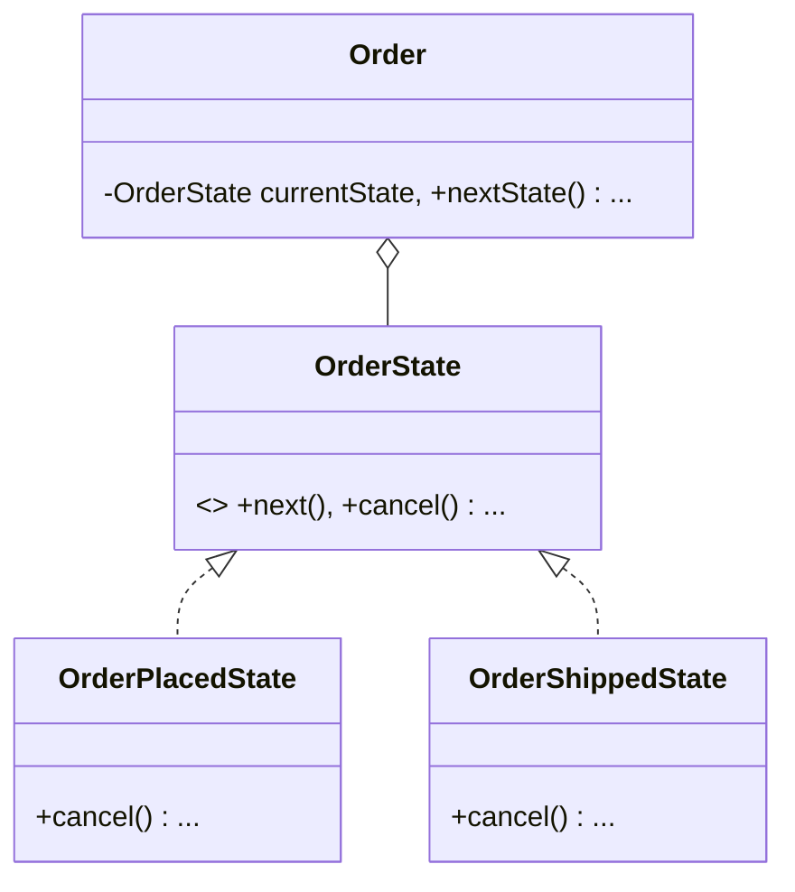

# Order Management (State Pattern)

This example demonstrates how the State pattern manages a business workflow with state-specific rules.

## Examples in this Folder

### 1. [Good Code](./GoodCode/)
- **Design**: The order transitions through `Placed`, `Shipped`, and `Delivered`.
- **Benefit**: Business rules (like "cannot cancel after shipping") are cleanly encapsulated within the `ShippedState` class.

## UML Diagram

