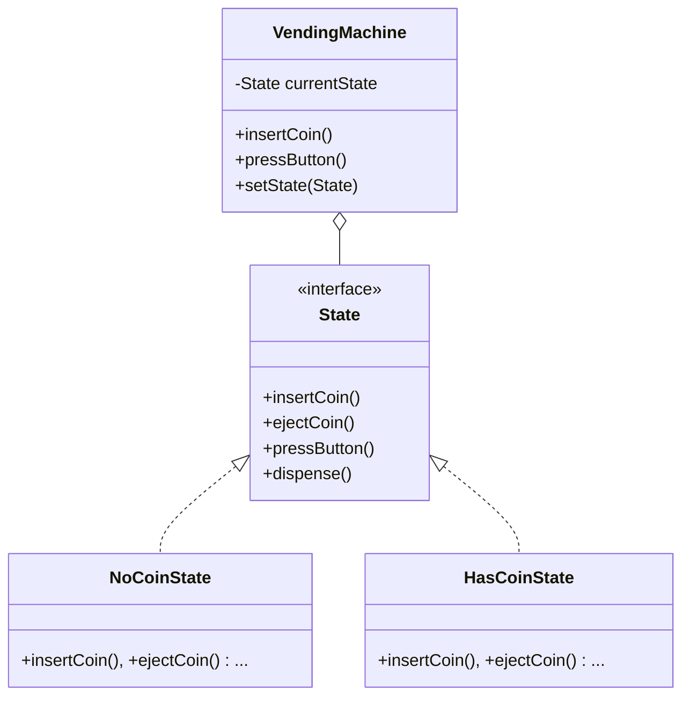
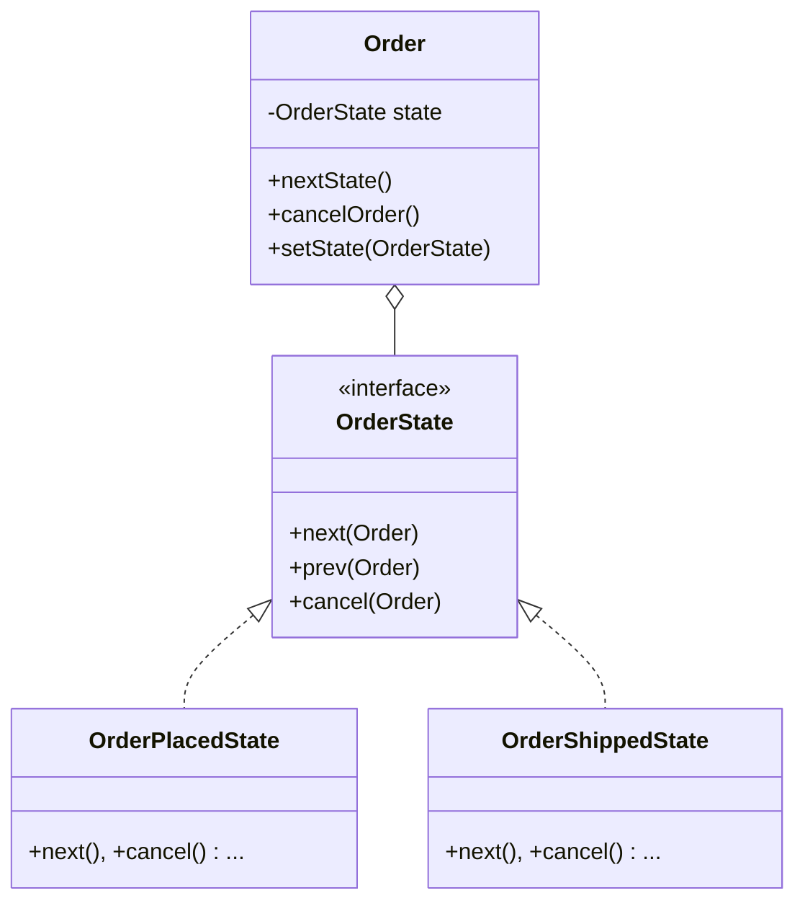

# State Design Pattern

> "Allow an object to alter its behavior when its internal state changes. The object will appear to change its class." - GoF

## Overview
The State pattern is a behavioural design pattern that allows an object to change its behavior at runtime by changing its internal state object. This pattern is particularly useful for avoiding complex `if-else` or `switch` statements that depend on an object's state.

### When to Use?
1. **State-Dependent Behavior**: When an object's behavior depends on its state, and it must change its behavior at runtime depending on that state.
2. **Avoiding Massive Conditionals**: When you have large, unwieldy conditional statements (like a giant `switch` or many `if-else` blocks) that manage state transitions.
3. **State Transitions are Logic-Heavy**: When the logic for transitioning from one state to another is complex and you want to encapsulate it.

## Key Concept: Context & State

| Component | Responsibility |
| :--- | :--- |
| **Context** | The class that has a state. It defines the interface of interest to clients and maintains an instance of a Concrete State. |
| **State Interface** | Defines an interface for encapsulating the behavior associated with a particular state of the Context. |
| **Concrete States** | Each subclass implements a behavior associated with a state of the Context. |

---

## UML Diagrams

### 1. Vending Machine (Operational State)

### 2. Order Management (Workflow State)

---

## Examples in this Folder

### 1. [Vending Machine System](./VendingMachineExample/)
- **Concept**: A machine that moves through `NoCoin`, `HasCoin`, `Dispensing`, and `SoldOut` states.
- **Problem**: In the **Bad Code**, every action (like `insertCoin`) has a giant `if-else` block checking the current state.
- **Solution**: Each state is its own class. The `VendingMachine` simply delegates the action to the current state object.

### 2. [Order Management System](./OrderManagementExample/)
- **Concept**: An e-commerce order that transitions from `Placed` to `Shipped` to `Delivered`.
- **Logic**: Business rules are enforced by the states. For example, `ShippedState` prevents the `cancel()` action, while `PlacedState` allows it.

---

## How to Run

### Vending Machine
- [VendingMain.java](./VendingMachineExample/GoodCode/VendingMain.java)
- [BadVendingMain.java](./VendingMachineExample/BadCode/BadVendingMain.java)

### Order Management
- [OrderMain.java](./OrderManagementExample/GoodCode/OrderMain.java)

---
## Navigation
- [Vending Machine Example](./VendingMachineExample/)
- [Order Management Example](./OrderManagementExample/)
