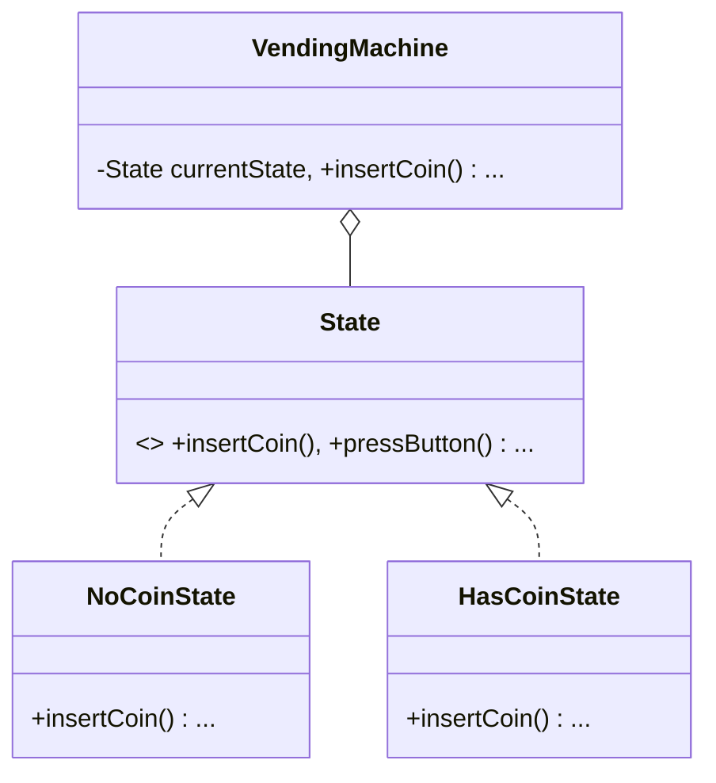

# Vending Machine (State Pattern)

This example demonstrates how the State pattern manages operational states in a hardware-like system.

## Examples in this Folder

### 1. [Good Code](./GoodCode/)
- **Design**: Each state (`NoCoin`, `HasCoin`, etc.) is a class. The `VendingMachine` delegates its behavior to these objects.
- **Benefit**: Adding a new state (like `MaintenanceState`) just requires a new class, rather than modifying every method in the `VendingMachine`.

### 2. [Bad Code](./BadCode/)
- **Problem**: Uses a giant switch-case or nested if-else blocks inside a single class.
- **Consequence**: High cyclomatic complexity and difficult maintenance.

## UML Diagram

