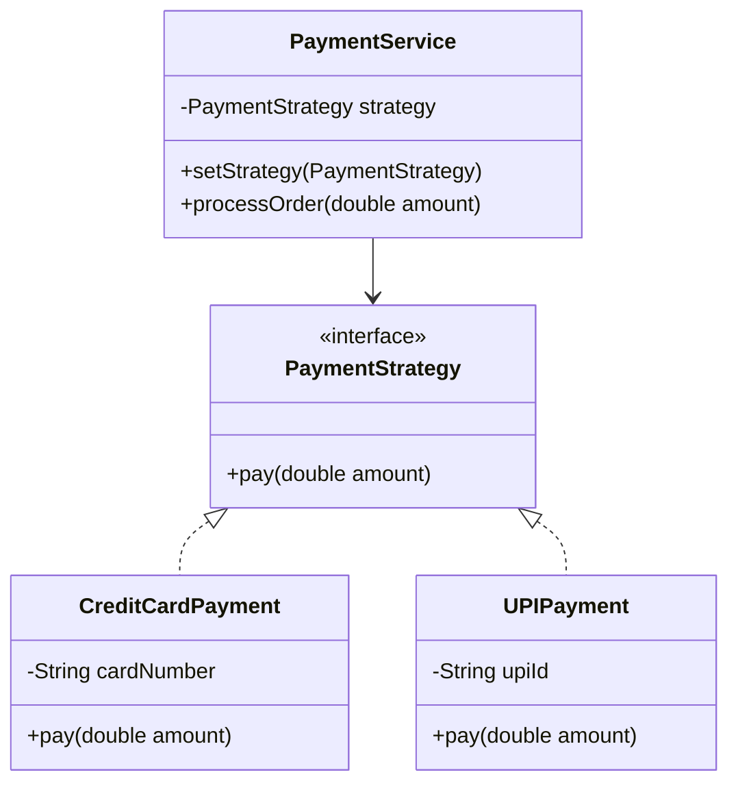

# Strategy Pattern

> "Define a family of algorithms, encapsulate each one, and make them interchangeable. Strategy lets the algorithm vary independently from clients that use it."

## Overview
The Strategy pattern is a behavioural design pattern that allows an algorithm's behavior to be selected at runtime. It defines a family of algorithms, encapsulates each one, and makes them interchangeable.

### When to Use?
1. **Multiple Versions of an Algorithm**: When you have many related classes that differ only in their behavior.
2. **Switching Logic at Runtime**: When you need different variants of an algorithm and want to be able to switch between them.
3. **Avoiding Conditional Statements**: When you have a massive `if-else` or `switch` block that selects a behavior.
4. **Isolating Complex Logic**: When an algorithm uses data that the client shouldn't know about.

## UML Diagram

## Key Concept: Context & Strategy

| Component | Responsibility |
| :--- | :--- |
| **Strategy Interface** | The common interface for all supported algorithms. |
| **Concrete Strategy** | Implements the specific algorithm using the Strategy interface. |
| **Context** | Maintains a reference to a Strategy object and communicates with it to perform a task. |

## Examples in this Folder

### 1. [Bad Code](./BadCode/)
- **Problem**: Implements a **Payment Processor** using large `if-else` blocks to handle different payment methods (Credit Card, UPI, PayPal). This violates the **Open-Closed Principle** as adding a new payment method requires modifying the processor.

### 2. [Good Code](./GoodCode/)
- **Design**: Encapsulates each payment method into its own strategy class ([CreditCardPayment.java](./GoodCode/CreditCardPayment.java), [UPIPayment.java](./GoodCode/UPIPayment.java)) implementing the [PaymentStrategy.java](./GoodCode/PaymentStrategy.java) interface.
- **Result**: The [PaymentService.java](./GoodCode/PaymentService.java) (Context) remains unchanged when new payment methods are added. Strategies are swapped at runtime in [StrategyMain.java](./GoodCode/StrategyMain.java).

## How to Run
- `BadCode/BadPaymentProcessor.java` (Logic is hardcoded and rigid)
- `GoodCode/StrategyMain.java` (Logic is flexible and swappable)
