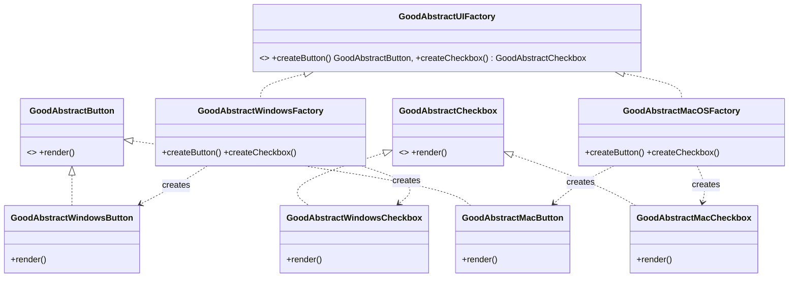

# Abstract Factory Pattern

> "Provide an interface for creating families of related or dependent objects without specifying their concrete classes."

## Overview
While the **Factory Method** handles the creation of a single product (like a Notification), the **Abstract Factory** handles the creation of **families of related products**.

A classic example is a cross-platform UI toolkit. If you are building an app for both Windows and Mac, you need buttons, checkboxes, and text fields. 
- A **Windows button** must always be paired with a **Windows checkbox**.
- Mixing a Mac button with a Windows checkbox would lead to an inconsistent and broken User Experience.

The Abstract Factory ensures that your application always uses a consistent family of objects.

### Comparison
| Feature | Factory Method | Abstract Factory |
| :--- | :--- | :--- |
| **Focus** | One product | A family of related products |
| **Complexity** | Simple | More complex (Factory of Factories) |
| **Method** | Inheritance (Subclasses override a method) | Composition (Factory object is passed to the client) |

## UML Diagram

## Examples in this Folder
- **Design**: We use a **Single "Fat" Factory** ([BadFatUIFactory.java](./BadCode/BadFatUIFactory.java)). This factory tries to handle all components for all platforms in one class.
- **Problem**: 
    1. **Repetitive Logic**: Every method in the factory has its own duplicate `if-else` block for platforms.
    2. **Mismatch Risk**: The Client must pass the platform string to every method call. If the client makes an error, you end up with a Windows Button and a Mac Checkbox. Consistency is NOT guaranteed.

### 2. [Good Code](./GoodCode/)
- **Design**: We use the **Abstract Factory Pattern**.
- **Refactoring**: 
    - [GoodAbstractUIFactory.java](./GoodCode/GoodAbstractUIFactory.java) defines the family.
    - Each platform has its own dedicated factory (e.g., [GoodWindowsUIFactory.java](./GoodCode/GoodAbstractWindowsFactory.java)).
- **Benefit**: The platform is determined ONCE when the factory object is created. Consistency is **enforced by design**. All creation methods are zero-argument, making mismatches impossible.

## How to Run
- `BadCode/BadAbstractMain.java` (Manual/Fragile creation)
- `GoodCode/GoodAbstractMain.java` (Consistent family creation)
