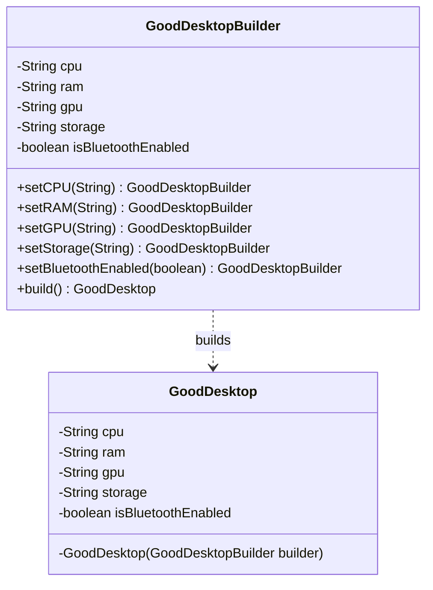

# Builder Pattern

> "Separate the construction of a complex object from its representation so that the same construction process can create different representations."

## Overview
The Builder pattern is a solution to the **Telescoping Constructor** anti-pattern. Telescoping constructors occur when a class has numerous optional parameters, leading to a long list of constructors—each with an increasing number of arguments.

### The Problem
1. **Unreadable Code**: `new User("John", "Doe", null, 25, null, true)`—it's impossible to tell what the `null`s or the `boolean` represent without looking at the class definition.
2. **Maintenance Nightmare**: Adding a new optional field requires adding many new constructors or breaking existing ones.
3. **Inflexibility**: You cannot easily pick and choose which parameters to set.

### The Solution
The Builder pattern provides a way to build a complex object step-by-step. It typically uses an inner static class (the Builder) and **Method Chaining** (a Fluent API) to make object creation intuitive and readable.

## UML Diagram

## Examples in this Folder

### 1. [Bad Code](./BadCode/)
- **Problem**: Uses **Telescoping Constructors**.
- **Result**: Creation logic in `BadBuilderMain.java` is cluttered with "mystery nulls" and is hard to follow.

### 2. [Good Code](./GoodCode/)
- **Design**: Implements a static inner `Builder` class in [GoodUser.java](./GoodCode/GoodUser.java).
- **Result**: The client code in [GoodBuilderMain.java](./GoodCode/GoodBuilderMain.java) reads like a sentence: `User.builder().name("John").age(30).build();`.

## How to Run
- `BadCode/BadBuilderMain.java` (The "Mystery Null" approach)
- `GoodCode/GoodBuilderMain.java` (The "Fluent API" approach)
