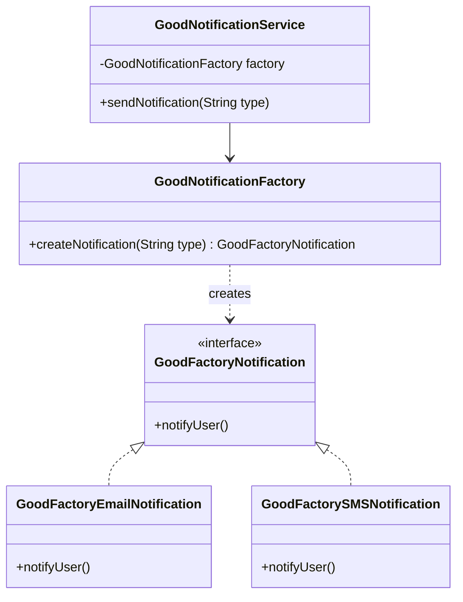

# Factory Design Pattern

> "Define an interface for creating an object, but let subclasses decide which class to instantiate."

## Overview
The Factory Pattern is one of the most used design patterns in Java. It is a creational pattern that provides one of the best ways to create an object. 

Instead of calling `new EmailNotification()` or `new SMSNotification()` directly in your main logic, you ask a **Factory** to provide you with the correct notification object based on a type or configuration.

### Key Benefits
- **Decoupling**: The client code doesn't need to know the concrete classes or how they are created.
- **Stable Client (Main)**: If the initialization logic changes (e.g., adding a new parameter to a constructor), your `Main` class remains unaffected. Only the Factory needs to change.
- **Scalability**: Adding a new notification type (e.g., WhatsApp) is much easier. You create the new class and update the Factory; the rest of the app "just works".
- **Maintainability**: Object creation logic is centralized in one place.

## UML Diagram

## Examples in this Folder (3-Layer Architecture)
We use a 3-layer approach: **Client (Main)** -> **Business Logic (Service)** -> **Object Creation**.

### 1. [Bad Code](./BadCode/)
- **Design**: The [BadNotificationService.java](./BadCode/BadNotificationService.java) contains the `if-else` logic itself.
- **Problem**: The business logic is tightly coupled to concrete classes. If we add a new notification type, we must **modify the service**. This makes the middle layer unstable.

### 2. [Good Code](./GoodCode/)
- **Design**: The [GoodNotificationService.java](./GoodCode/GoodNotificationService.java) uses the [GoodNotificationFactory](./GoodCode/GoodNotificationFactory.java) to handle creation.
- **Benefit**: The service layer is stable. Adding new notification types only requires updating the Factory. The **Service layer remains untouched**, perfectly adhering to the Open/Closed Principle.

## How to Run
- `BadCode/BadFactoryMain.java` (Unstable Service)
- `GoodCode/GoodFactoryMain.java` (Stable, Decoupled Service)
