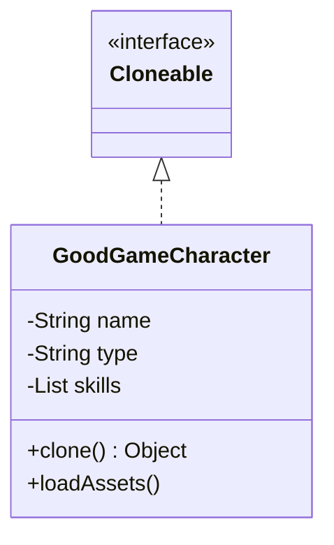

# Prototype Pattern

> "Specify the kinds of objects to create using a prototypical instance, and create new objects by copying this prototype."

## Overview
The Prototype pattern is a creational design pattern that allows an object to "clone" itself. It is particularly useful when creating a new instance of an object is more expensive than copying an existing one.

### When to Use?
1. **Performance**: If creating an object involves heavy database queries, complex calculations, or network calls.
2. **Avoiding Complexity**: If your object has a massive number of configuration options (like the Builder pattern) but you frequently need several similar copies.
3. **State Splitting**: When you want to keep the original state of an object while modifying a copy of it.

## Key Concept: Shallow vs. Deep Copy

| Feature | Shallow Copy | Deep Copy |
| :--- | :--- | :--- |
| **Defintion** | Copies only the primitive values of the object. References (like lists or other objects) still point to the same memory. | Recursively copies everything. References point to new instances of the data. |
| **Risk** | Changing a list in the copy will change it in the original too. | Safe to modify anything; the copy is fully independent. |
| **Ease** | Java's default `Object.clone()` is a shallow copy. | Must be manually implemented (often by copying field by field). |

## UML Diagram

## Examples in this Folder

### 1. [Bad Code](./BadCode/)
- **Problem**: Simulates creating **Game Characters** that require heavy "Asset Charging" (simulated with `Thread.sleep`). Creating multiple characters from scratch is slow.

### 2. [Good Code](./GoodCode/)
- **Design**: Implements the `Cloneable` interface in [GoodGameCharacter.java](./GoodCode/GoodGameCharacter.java).
- **Result**: We initialize one prototype character and then clone it to create others instantly.

### 3. [Copy Comparison](./CopyComparison/)
- **Design**: Contrasts **Shallow Copy** (default) vs **Deep Copy** (manual).
- **Result**: Demonstrates why deep copying is necessary when objects contain references to other objects (like a skills list).

## How to Run
- `BadCode/BadPrototypeMain.java` (Notice the time delay)
- `GoodCode/GoodPrototypeMain.java` (Notice how fast it becomes)
- `CopyComparison/CopyComparisonMain.java` (Notice the difference in memory behavior)
