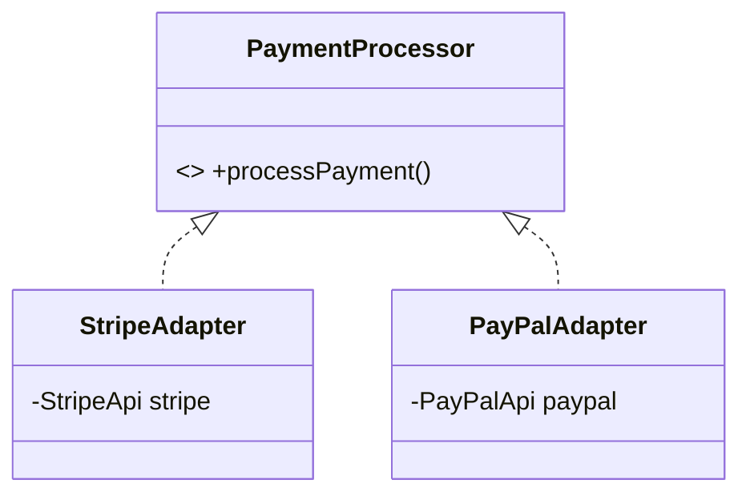

# Payment Gateway Adapter

This example demonstrates how to unify multiple incompatible third-party payment APIs under a single interface.

## Examples in this Folder

### 1. [Good Code](./GoodCode/)
- **Design**: Uses `StripeAdapter` and `PayPalAdapter` to map their specific methods (`makePayment`, `sendMoney`) to a standard `processPayment` interface.
- **Benefit**: You can process a list of different processors uniformly in a loop.

### 2. [Bad Code](./BadCode/)
- **Problem**: The service is tightly coupled to specific providers, requiring `if-else` checks and knowledge of internal method names for every vendor.

## UML Diagram

