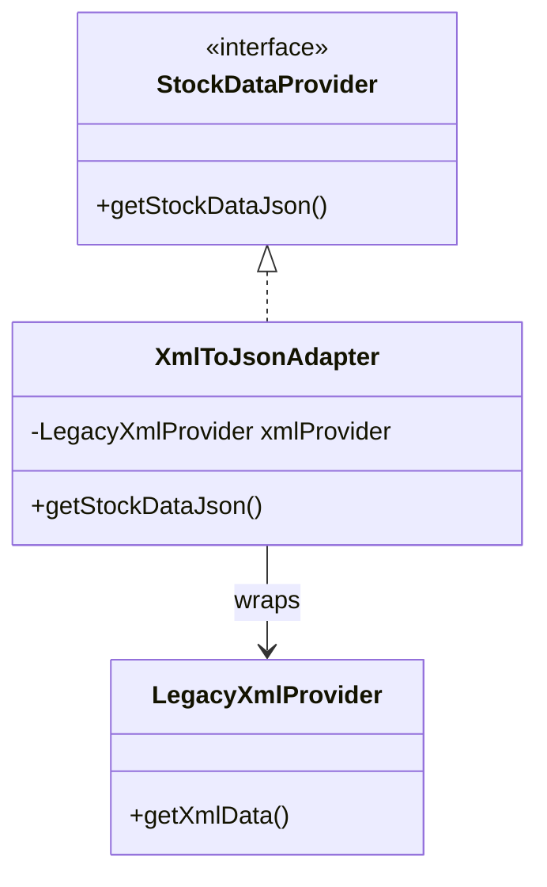
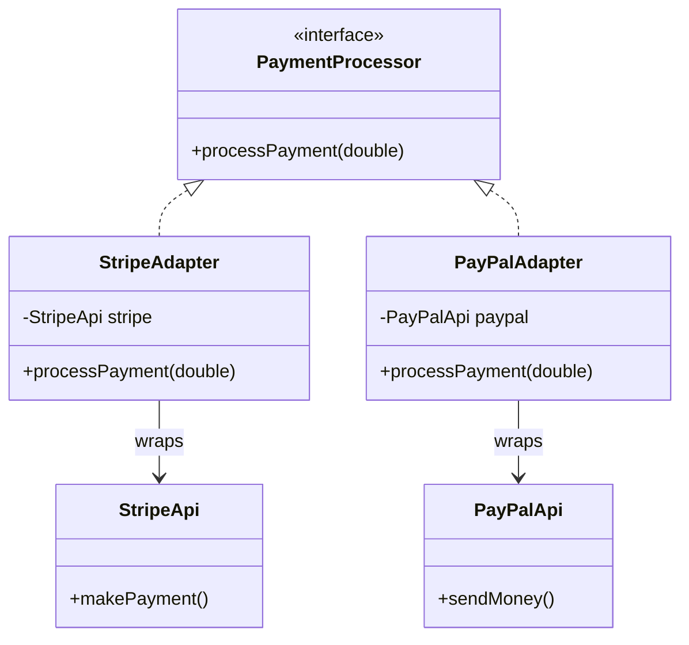

# Adapter Design Pattern

> "Allow objects with incompatible interfaces to collaborate. It acts as a wrapper between two objects." - GoF

## Overview
The Adapter pattern is a structural design pattern that allows objects with incompatible interfaces to work together. It acts as a bridge between two independent or incompatible interfaces, converting the interface of a class into another interface that a client expects.

### When to Use?
1. **Incompatible Third-Party Libraries**: When you want to use an existing class, but its interface doesn't match the one you need.
2. **Legacy System Integration**: When you need to integrate a legacy system with a modern codebase without modifying the legacy code.
3. **Data Conversion**: When you need to convert data formats (e.g., XML to JSON) between different parts of a system.
4. **Uniform API Access**: When you want to treat multiple different providers (like various payment gateways) as a single type.

## Key Concept: Target, Adaptee & Adapter

| Component | Responsibility |
| :--- | :--- |
| **Client** | The class that contains the existing business logic and expects a specific interface. |
| **Target Interface** | The interface that the client expects and uses. |
| **Adaptee** | The legacy or third-party class that has an incompatible interface. |
| **Adapter** | A class that implements the Target interface and wraps the Adaptee. |

---

## UML Diagrams

### 1. XML to JSON Adapter

### 2. Payment Gateway Adapter (Multi-Provider)

---

## Examples in this Folder

### 1. [XML to JSON Adapter](./XmlToJsonExample/)
- **Problem**: A modern analytics tool expects JSON, but a legacy provider outputs XML.
- **Solution**: An adapter that fetches XML and converts it to JSON on the fly.

### 2. [Payment Gateway System](./PaymentGatewayExample/)
- **Problem**: Different payment providers (Stripe, PayPal) have different method names and structures.
- **Solution**: A unified `PaymentProcessor` interface and specific adapters for each provider.
- **Benefit**: The application can switch providers or add new ones without changing the checkout logic.

---

## How to Run

### XML to JSON Example
- [AdapterMain.java](./XmlToJsonExample/GoodCode/AdapterMain.java)

### Payment Gateway Example
- [PaymentMain.java](./PaymentGatewayExample/GoodCode/PaymentMain.java)

---
## Navigation
- [Structural Design Patterns](../)
- [XML to JSON Example](./XmlToJsonExample/)
- [Payment Gateway Example](./PaymentGatewayExample/)
