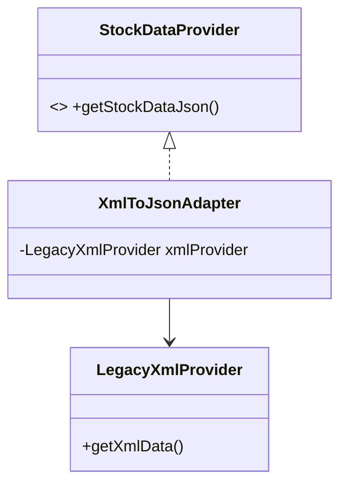

# XML to JSON Data Adapter

This example demonstrates how to use the Adapter pattern to bridge the gap between a legacy data provider and a modern analytics tool.

## Examples in this Folder

### 1. [Good Code](./GoodCode/)
- **Design**: Uses an `XmlToJsonAdapter` to convert the `LegacyXmlProvider` output into a format compatible with `ModernAnalyticsTool`.
- **Benefit**: The analytics tool is decoupled from the data format.

### 2. [Bad Code](./BadCode/)
- **Problem**: The analytics tool fails to process the XML data, or the client code becomes cluttered with manual conversion logic.

## UML Diagram

