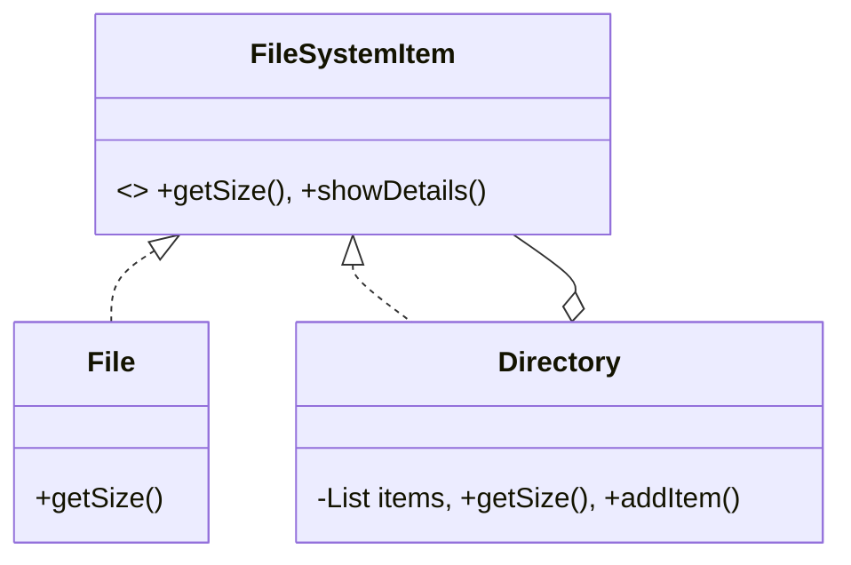

# File System (Composite Pattern)

This example demonstrates how to represent a file system hierarchy using the Composite pattern.

## Examples in this Folder

### 1. [Good Code](./GoodCode/)
- **Design**: Both `File` (Leaf) and `Directory` (Composite) implement the `FileSystemItem` interface.
- **Benefit**: Calculating total size becomes a simple recursive call. The client doesn't need to know if it's talking to a file or a folder.

### 2. [Bad Code](./BadCode/)
- **Problem**: The `Directory` class must maintain separate lists for files and subdirectories, leading to duplicated logic and rigid code.

## UML Diagram

