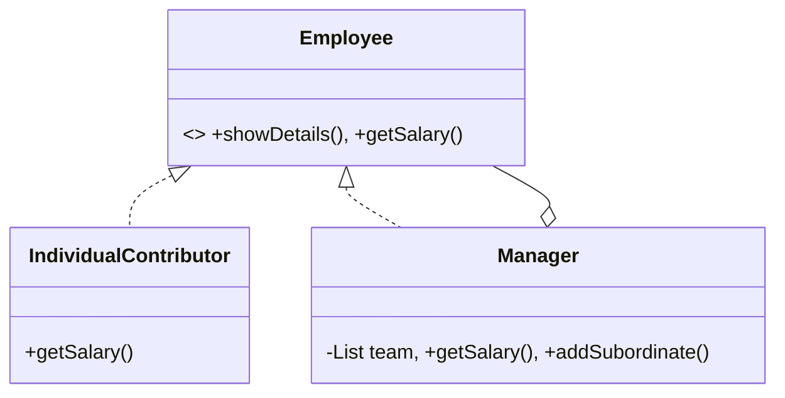

# Organization Structure (Composite Pattern)

This example demonstrates how to represent a corporate hierarchy using the Composite pattern.

## Examples in this Folder

### 1. [Good Code](./GoodCode/)
- **Design**: `IndividualContributor` and `Manager` share the `Employee` interface.
- **Benefit**: You can call `getSalary()` on any node to get the salary of that individual or the total budget for the team under that manager.

## UML Diagram

