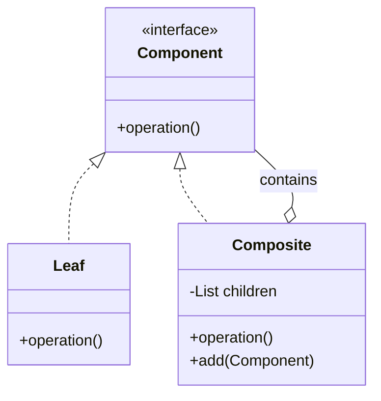
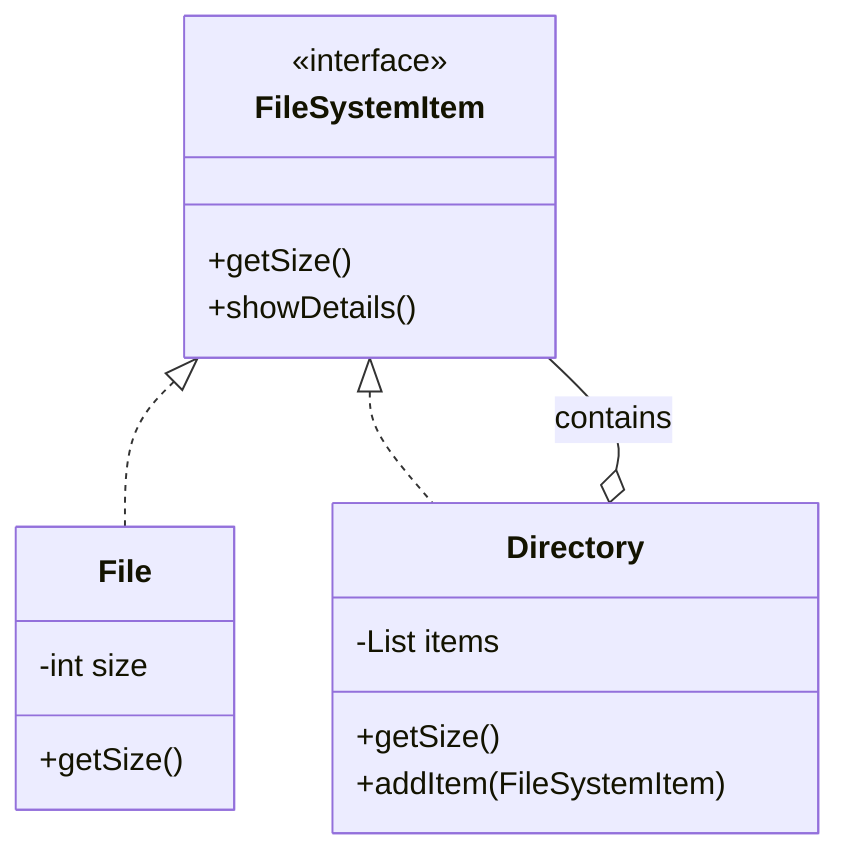

# Composite Design Pattern

> "Compose objects into tree structures to represent part-whole hierarchies. Composite lets clients treat individual objects and compositions of objects uniformly." - GoF

## Overview
The Composite pattern is a structural design pattern that allows you to treat a group of objects as a single instance of an object. It is used to create complex tree structures where both the "leaves" (individual items) and the "branches" (groups of items) share the same interface.

### When to Use?
1. **Tree Structures**: When you need to represent part-whole hierarchies of objects (e.g., File systems, UI components, XML/HTML documents).
2. **Uniform Treatment**: When you want clients to ignore the difference between compositions of objects and individual objects.
3. **Recursive Operations**: When you need to perform operations recursively over a structure (e.g., calculating total size, drawing a UI, or printing a hierarchy).

## Key Concept: Component, Leaf & Composite

| Component | Responsibility |
| :--- | :--- |
| **Component Interface** | The base interface that defines common operations for both simple and complex objects. |
| **Leaf** | Represents individual objects that don't have children. They implement the base operations. |
| **Composite** | Represents complex objects that have children (both Leaves and other Composites). They implement the base operations by delegating them to their children. |

---

## UML Diagrams

### 1. General Structure

### 2. File System Implementation

---

## Examples in this Folder

### 1. [File System](./FileSystemExample/)
- **Concept**: A structure where a `Directory` can contain both `File` objects and other `Directory` objects.
- **Problem**: In the **Bad Code**, the client must distinguish between files and directories to calculate total size, leading to messy loops and type checks.
- **Solution**: Both `File` and `Directory` implement `FileSystemItem`. The `Directory` just iterates over its children and calls `getSize()` regardless of what they are.

### 2. [Organization Structure](./OrganizationExample/)
- **Concept**: A corporate hierarchy where a `Manager` manages a team of `Employee`s (who could be developers or other managers).
- **Benefit**: You can calculate the total salary budget for the entire organization or any sub-department by calling `getSalary()` on the top-level node.

---

## How to Run

### File System Example
- [FileSystemMain.java](./FileSystemExample/GoodCode/FileSystemMain.java)

### Organization Example
- [OrganizationMain.java](./OrganizationExample/GoodCode/OrganizationMain.java)

---
## Navigation
- [Structural Design Patterns](../)
- [File System Example](./FileSystemExample/)
- [Organization Example](./OrganizationExample/)
